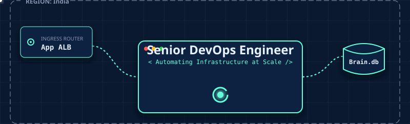
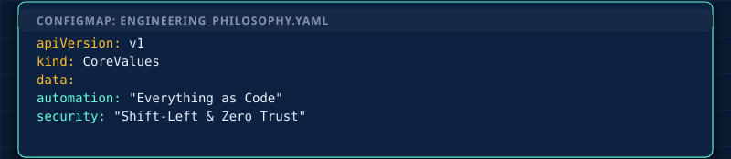
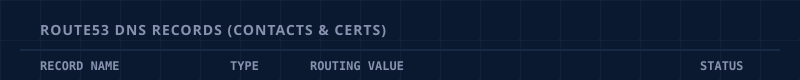

<!-- ARCHITECTURAL BLUEPRINT: HEADER (About Me) -->

<!-- ARCHITECTURAL BLUEPRINT: ENGINEERING PHILOSOPHY -->

<!-- ARCHITECTURAL BLUEPRINT: CONTACT INFO & LINKS (Route53 DNS) -->

  
  
  
  
  
  

<!-- ARCHITECTURAL BLUEPRINT: TECH STACK NETWORK -->

<!-- ARCHITECTURAL BLUEPRINT: GITHUB STATS -->

<!-- INTERACTIVE DEPLOYMENTS (REPO CARDS) -->

  
  
  

